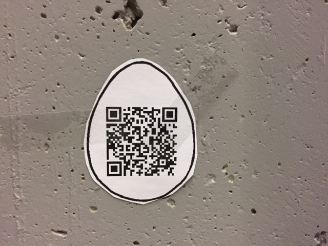
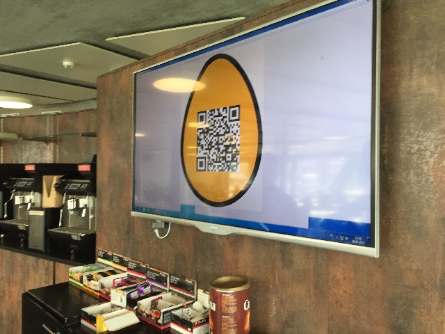
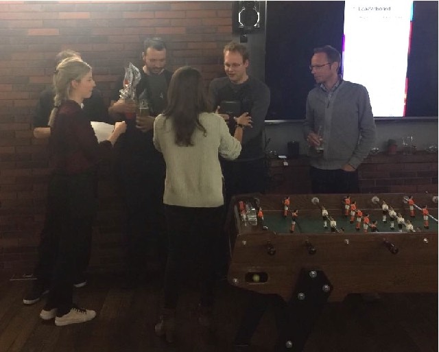
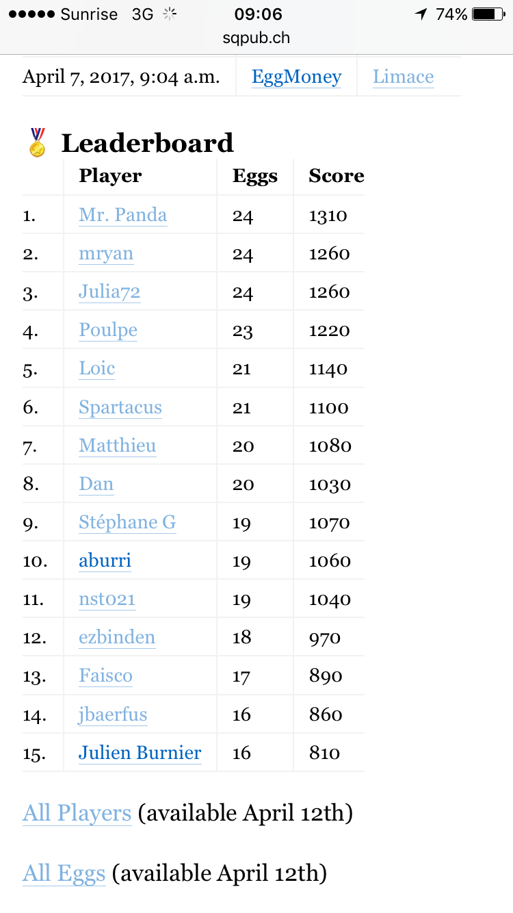
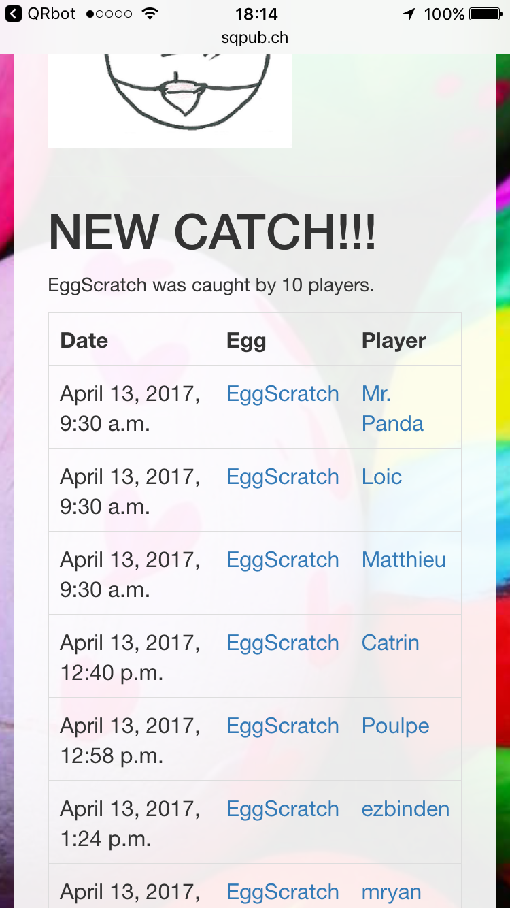
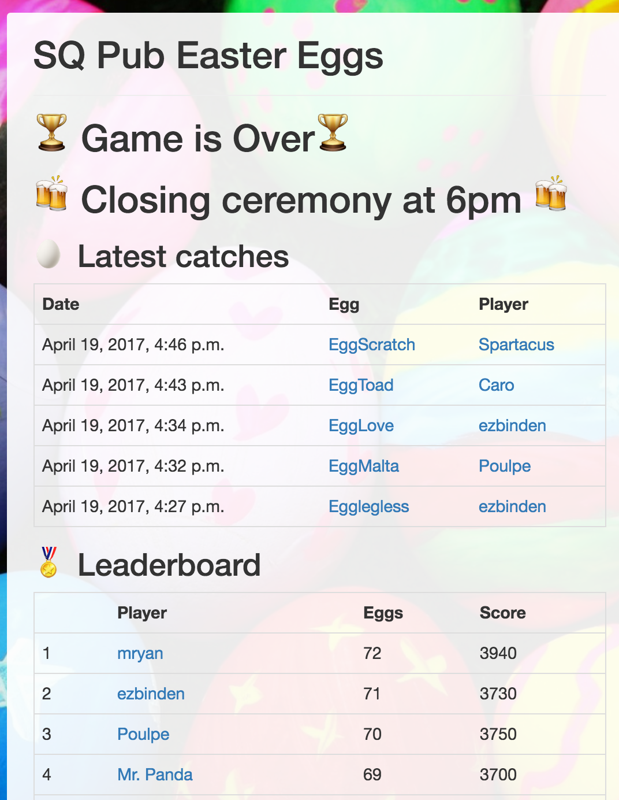

# EasterEggs
A social game that consists in catching QR-codes

"SQPub Easter Eggs" is an online, social game that ran for two weeks during the Easter period.

The game was made as an animation for our corporate pub.

Basically, the game is a virtual egg catch, where eggs consist in an egg-shaped piece of paper with a printed QR code inside.

The QR code contains the secret URL of an egg, such as `http://sqpub.ch/egg/6059abf965fc4ca4a612ee9972001b57`. Opening this URL lets the player see the egg name / points / image and actually "catch" the egg. The egg can still be caught by other players.

Every day, the barmaid prints and hides a few eggs in the company premises such as the pub, the cafeteria, the terrace or the stairs.

In order to play, people just need to scan an egg. If they never played before, they have to enter a nickname.

From there, players can access the whole web site and check the leaderboard, the latest catches, other player's eggs and also the list of players that caught a specific egg.

From time to time, the leaderboard was displayed in a big screen in the cafeteria.

Also, we tried to add new stuff regularly to keep the game interesting.

For the record, here is a rough chronology of what we did.

| Date   | Description |
| ------ | ----------- |
| 2017-03-27 | Testing week   A handful of testers had access to both sample code and the admin part. They could discuss and report issue through a WhatsApp group. At the end of the test period, their profiles were cleared and the admin password was changed. |
| 2017-04-04 | Game announced by email to the whole company |
| 2017-04-05 | Game starts |
| 2017-04-07 | REST API  I implemented a REST API, so that players could build their own tools. Someone built an Expo mobile app https://expo.io/@onigoetz/egg-hunt. In particular, this app lets players catch eggs and store them locally before sending them to the server, in order to delay the catch appearance in the leaderboard. |
| 2017-04-09 | Added list of all eggs + list of all players |
| 2017-04-10 | Giant egg displayed on cafeteria screen |
| 2017-04-10 | New web design using Bootstrap |
| 2017-04-12 | Fox steal eggs (not published)   The idea was that an egg catch would randomly turn into a fox, that would steal or break one of your eggs. |
| 2017-04-13 | Follow-up email to the whole company |
| 2017-04-13 | EuroChicken lottery  I added this feature to meet the following needs: 1) I wanted the players to be able to play during the 4 days of the Easter week end, when most people were not present at work and 2) I wanted to flatten the leaderboard and help the players with just a couple of eggs. After a fixed delay (2 hours the 1st day, 8 hours after) EuroChicken gives you an egg picked randomly among all the eggs that were already caught. The lottery helped in balahadn't caught yet. |
| 2017-04-19 | List combo winners (sets of eggs that go together, eg. the Simpson family members, etc) |
| 2017-04-19 | Totem roulette (not published)  The idea here was to provide a giant egg on top of a totem. During the closing ceremony, people would have the choice to scan it and randomly win or lose some eggs. We chose not to do it because we did not find a fair rule, and also because destructive actions should not be possible when playing on behalf of other players. |
| 2017-04-20 | Game ends Closing ceremony at the pub. |

#### Authentication

An interesting characteristic of the game is that players are identified, but not authenticated. That is, they have no password, they only declare their name, so everybody can play on behalf of others.

As a result, it was difficult to add cool but destructive features such as a fox breaking eggs or eggs with negative points.

But overall, the lack of authentication was a key part of the quick onboarding and the whole game simplicity.

#### Presentation

<!-- **TODO: main page overview** -->

We observed that the structure of the main page (Latest Catches, Leaderbord and EuroChicken) was critical to the game success.

Indeed, the first table lists the 5 last catches. Players would check it carefully, because when they saw very recent catches, they looked around and tried to spot the catchers and guess where the eggs were.

Also, displaying the top 15 players does exacerbate the competition, since winners don't want to lose their rank.

Finally, displaying the EuroChicken countdown on the main page was an efficient incentive to make people check the main page regularly.

Regarding the design / CSS aspect, I started by including `https://unpkg.com/awsm.css/dist/awsm.min.cs` which is a very simple and effective way to set a minimal style to your vanilla HTML. But someone told me it was ugly, and one of our trainees proposed that we use Bootstrap.

#### Player Strategies

Players developed unexpected strategies.

Some of them kept the URLs, either to trade them against with other players, or to delay the catch just to deceive other players.

#### Technology and Source Code

The technology stack is a GoDaddy server running the Django / SQLite.

QR codes are an external API to display QR codes:

    https://api.qrserver.com/v1/create-qr-code/?size=150x150&data=http://sqpub.ch/egg/a9d526314457402187b6e1aa8f4f2e02

Altogether, server and domain name did cost 60 CHF for one year, which is very little money compared to all the fun we had.

The whole source code is available on https://github.com/nst/EasterEggs

#### Conclusion

Here are some key figures to support everyone's opinion that the game was an unexpected success.

- 60 players cought 2 or more eggs
- 1305 catches overall
- the pub was crowded for the closing ceremony a Wednesday evening

It was a great lot of fun to see people going crazy about hunting a worthless but scarce 32 bits hashes. People who had never talked before started chatting, exchanging hints and discussing about the game.

#### Next Year

Next year, I intend to run a variation of this game, but with the thrill of the "Survivor" or "Koh Lanta" TV shows.

Players will typically be split into the red and the yellow teams. From there, you can imagine every kind of sadistic mutation among teams, like each week the two worse hunters, or less voted hunters, change team with their eggs. Each day or so, a challenge or a new rule could help spicing up the game. I have 300+ days to think about it.

#### Code

Run the project on your machine: `python manage.py runserver`

Database credentials: `sqpub` / `changeme123`
